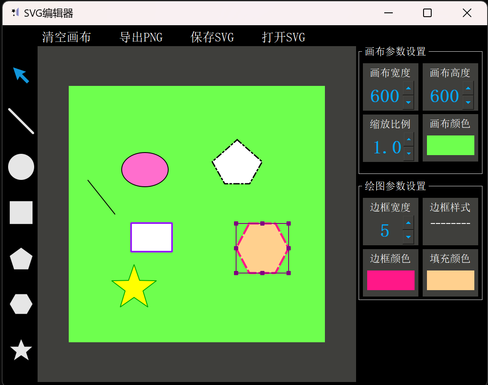

# SVG编辑器

## 1 效果展示

### 1.1 主界面



**打开和保存SVG功能暂未实现，欢迎大佬补充。**

### 1.2 拥有的功能

- [x] 直线、圆形、矩形、五边形、六边形、五角星的绘制，绘制过程中使用虚线显示边界矩形
- [x] 选中绘制的图形后以蓝色高亮显示其边框，并显示八个用来拖拽变化的控制点（设置五角星除外，因为不涉及拖拽变换）
- [x] 在选中图形后，鼠标放到控制点时会根据这八个控制点的位置自动变化形状，不在控制点则为普通箭头形状（设置五角星除外，因为不涉及拖拽变换）
- [x] 直线、圆形、矩形、五边形、六边形、五角星的拖拽移动
- [x] 直线、圆形、矩形、五边形、六边形的拖拽变换
- [x] 设置直线、圆形、矩形、五边形、六边形、五角星的边框宽度、边框样式、边框颜色、填充颜色
- [x] 点击图形进行选择，实时显示选中的图形的边框宽度、边框样式、边框颜色、填充颜色参数
- [x] 设置画布宽度、高度、背景颜色、缩放比例
- [x] 画布设置在`QScrollArea`中，当画布超过一定大小会触发滚动视图
- [x] 清空画布
- [x] 导出PNG

## 2 遇到的问题

### 2.1 头文件循环依赖，导致编译失败

当`kshapefactory.h`中包含头文件`kcanvas.h`，并且`kcanvas.h`中又包含`kshapefactory.h`时，编译会产生如下错误。


原因就是，这两个头文件互相引用，导致编译器无法确定包含的顺序，从而无法解析这两个文件。

> 编译器处理`kshapefactory.h`时，包含`kcanvas.h`，处理`kcanvas.h`时，包含`kshapefactory.h`，由于使用了防止文件被重复包含的宏定义，编译器不会再次展开`kshapefactory.h`的内容，但会遇到不完整的类型声明。

解决方法就是，使其中一个头文件被包含在另一个头文件对应的`cpp`源文件中，而不是头文件中，这样可以解决循环依赖的问题。由于我的`kshapefactory.h`中`KShapeFactory`类的一些成员使用到了`kcanvas.h`中的内容，因此只能将`kshapefactory.h`包含在`kshapefactory.cpp`中。

### 2.2 MOC文件未生成，导致编译失败

如果使用了`QObject`，但是却没有生成moc文件，编译会出现如下所示的链接错误。


正常情况下，在VS中配置好QT插件，在代码的头文件中加上**`Q_OBJECT`宏**，会自动在项目代码目录的`x64/Debug(Release)/moc`目录下生成moc文件，但是也有时候VS抽风没有自动生成，那怎么办呢？

**解决方法有三种（亲测都有效）：**

第一种方法是：**重启VS**

第二种方法是：**手动生成moc文件**

先将QT的bin目录添加到系统环境变量，然后打开cmd，利用下面的命令生成moc文件

```bash
moc 代码头文件名.h -o moc_代码头文件名.cpp
```

生成之后手动将此moc文件添加到项目中。

第三种方法是：**修改项目配置文件（`.vcxproj`文件）**

首先，打开`.vcxproj`文件，如果你的头文件没有自动生成moc文件，应该会这样显示

```bash
  <ItemGroup>
    <ClInclude Include="代码头文件名.h" />
  </ItemGroup>
```

然后，修改`ClInclude`为`QtMoc`

```bash
  <ItemGroup>
    <QtMoc Include="代码头文件名.h" />
  </ItemGroup>
```

最后，回到VS项目窗口，重新加载即可


### 2.3 编译报错“M_PI”: 未声明的标识符

明明导入了`cmath`头文件，使用M_PI宏定义时还是会报错，解决方法：

1）解决方法一：项目属性—>配置属性—>C/C++—>预处理器—>预处理器定义，输入`_USE_MATH_DEFINES`

2）解决方法二：收到添加该宏定义`#define M_PI  3.14159265358979323846`

### 2.4 清空画布时paintEvent不能按照预期的情况return

我设置了一个`bool`类型的变量，名为`m_isClearCanvas`，我预想是这样的，当我进行清空画布的操作时，我手动将其置为`true`，然后手动调用`update`函数，并在`paintEvent`函数中加入以下代码

```cpp
// 判断是否需要清空画布
if (m_isClearCanvas)
{
    m_isClearCanvas = false;
    return;
}
```

但是我发现return函数会经常失效，在它下面的语句还是会被执行。经分析发现，原因是**程序也会隐形的执行`paintEvent`函数**，因此尽管我手动设置`m_isClearCanvas`为true，但是当程序自动执行`paintEvent`函数时，`m_isClearCanvas`的值就被设置为了false，因此我后续尽管手动调用了`update`函数，此时的`m_isClearCanvas`已经变成了false，所以return无效。

解决方法是，我**将退出条件改为了检查保存绘制图形的链表是否为空并且`m_isClearCanvas`是否为`true` ，并且将`m_isClearCanvas = false`改写到了鼠标按下事件中**，便可以解决这个问题。

### 2.5 切换绘图标志后第一次绘图点击鼠标闪现出图形

问题如下：当我切换绘图标志时，第一次按下鼠标左键（此时鼠标还未移动），绘图界面会闪现出我要绘制的图形，并且起始坐标还是(0,0)。

但是，这些绘图操作是在`paintEvent`中，正常情况下当我鼠标按下并进行移动时才会绘制图形和图形的虚线边框，而我在鼠标按下事件中并未手动调用`update()`函数，这是怎么回事呢？进行调试看看吧！

经调试分析发现，`paintEvent`函数在我鼠标按下时会被自动调用，这就是问题所在！而我在鼠标按下时，只设置了图形的`m_startPoint`为我按下的位置，并没有设置`m_endPoint`，只需要增加设置`m_endPoint`的值也为我按下的位置即可，如下面的代码所示，即可解决该问题。

```cpp
if (event->buttons() == Qt::LeftButton)
{
    m_isLPress = true;	// 设置左键按下标志
    // 创建一个图形
    m_pCurrentShape = KShapeFactory::createShape(m_currentDrawFlag);
    // 设置起始的坐标点
    m_pCurrentShape->setStartPoint(m_lastPos);
    // 设置结束的坐标点
    m_pCurrentShape->setEndPoint(m_lastPos);
    m_isDrawing = true;	// 设置绘图标志
}
```


## 3 用到的技术

1）使用单独的 `KShapeParameter` 类，结合**单例模式**来设置全局的绘图参数，例如边框颜色、边框样式、填充颜色、边框宽度等。主界面通过槽函数来设置相关参数传递到此类，绘制图形时，图形的参数从该类进行获取。

2）对于界面的设计，主要是右侧的画布和图形参数设置的界面，在设置颜色属性时，我使用了`QPushButton`，同时通过`qss`来设置按钮的边框、背景颜色等设置，点击按钮会打开颜色对话框，选择的颜色除了会传递给`KShapeParameter`类，也会传递通过设置`qss`改变界面按钮的颜色，**如果没有选择图形，点击按钮会发出警告**，禁止设置颜色；在设置边框宽度时，我使用了`QSpinBox`，为了实现良好的用户交互，我给该组件安装了**事件过滤器**，该组件默认情况下是不可见的，当点击该组件或者试图用鼠标滑轮改变该组件的值时，如果`isEnabled()`返回的是`False`，则发出警告，**提示用户选择图形**，如果用户选择了图形，则该组件调用`setEnabled(true)`函数设置为可见。对于边框样式，我**自定义了一个继承自`QComBox`的组件**，同时设置一个`QListWidget`，来显示我要展示的边框样式，在选择了某个样式的同时，使用`QPainter`绘制相应的样式到组件上。同时，类似调整边框宽度的`QSpinBox`，该组件为了保证良好的用户交互体验也给其安装了**事件过滤器**，当组件状态为不可见时，试图更改组件的值会**发出警告，提示用户选择图形**。

3）选中图形时，**高亮显示一个矩形的图形边界，并绘制八个控制点**。我利用`QRect`类型的数组来保存这八个控制点，控制点设置成了边长为8的正方形，**其坐标根据我绘制图形的外部矩形边界进行计算**。

4）给画布组件安装事件过滤器，配合鼠标悬停事件，**当鼠标位于八个控制点之一时，更改鼠标形状**，方便拖拽变换。这里一定**使用`this->setAttribute(Qt::WA_Hover, true)`开启鼠标悬停**，否则没效果。如果我当前处于移动变换图形的模式下（即点击了左侧的第一个工具按钮），并且我当前的画布中存在已经被选中的图形，那么当我的鼠标不在控制点时，其形状是`Qt::ArrowCursor`（普通的箭头形状），当鼠标移动到图形的八个控制点时，会对应更换鼠标的形状为`Qt::SizeFDiagCursor`（左上角、右下角控制点）、`Qt::SizeVerCursor`（上下控制点）、`Qt::SizeBDiagCursor`（右上角和左下角控制点）和`Qt::SizeHorCursor`（左右控制点）。

5）点击图形时，**获取其图形参数并通过信号反馈给界面，更新UI组件**。当我处于选择状态，并点击了某个图形时，会获取该图形的边框宽度、边框样式、边框颜色、填充颜色并发生信号到主界面，**主界面会更新相关的组件状态，丰富了用户的体验**。

## 4 图形绘制核心原理

### 直线

```cpp
QPainter painter(this);
painter.drawLine(m_stantPoint, m_endPoint);
```

### 矩形

```cpp
QPainter painter(this);
painter.drawRect(QRectF(m_stantPoint, m_endPoint));
```

### 圆

```cpp
QPainter painter(this);
painter.drawEllipse(QRectF(m_stantPoint, m_endPoint));
```

### 五边形

如下图所示。


### 六边形


### 五角星

先获取五角星的矩形区域 `shapeRect`，计算中心点的坐标 `centerX` 和 `centerY`。外圆半径 `outerRadius` 是矩形宽度和高度的最小值的一半，内圆半径 `innerRadius` 是外圆半径的五分之二。

```cpp
QRectF shapeRect = getShapeRect();
qreal centerX = shapeRect.center().x();
qreal centerY = shapeRect.center().y();
qreal outerRadius = qMin(shapeRect.width(), shapeRect.height()) / 2.0;
qreal innerRadius = outerRadius / 2.5;
```

计算五角星的10个顶点。每个顶点的角度是36度的倍数。奇数索引的顶点使用外圆半径，偶数索引的顶点使用内圆半径。顶点的坐标通过极坐标转换为笛卡尔坐标。

```cpp
QPointF points[10];
for (int i = 0; i < 10; ++i) 
{
    double angle = M_PI / 5.0 * i; // 36度
    qreal radius = (i % 2 == 0) ? outerRadius : innerRadius;
    points[i] = QPointF(centerX + radius * cos(angle - M_PI / 2.0),
                        centerY + radius * sin(angle - M_PI / 2.0));
}
```

最后，使用 `drawPolygon` 绘制这十个顶点。

```cpp
painter.drawPolygon(points, 10);
```
